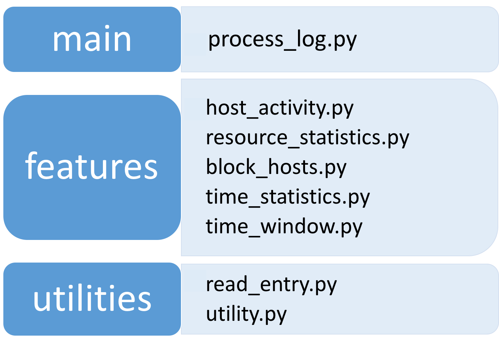

# Getting Started
Insight-fansite-analytics is running on Python 2.7 without any additional libraries. This project is designed for a NASA fan website that generates a large amount of Internet traffic data.  This code allows the users to dive into the log file and perform a large variety of statistical and security analysis. 

To get started, you first need to download the input file from [here](https://drive.google.com/file/d/0B7-XWjN4ezogbUh6bUl1cV82Tnc/view) and put it in the `log_input/` directory. By running the command:

    ./run.sh

the code will perform analysis on the server log data and write output files into `log_output/` directory. File `process.log` keeps track of the logout of this code.

# Table of Contents
1. [Feature Summary](README.md#feature-summary)
2. [Description of Data](README.md#description-of-data)
3. [Code Structure](README.md#code-structure)

## Feature Summary

This project is designed for a NASA fan website that generates a large amount of Internet traffic data.  The code allows the users to perform analytics on the server log file, get statistics on the web pages and user activity, and detect potential security breaches. 

### List of Features
1. [Most Active hosts](README.md#feature-summary)
2. [Description of Data](README.md#description-of-data)
3. [Code Structure](README.md#code-structure)
The features are described below: 

*  **Feature 1: Most Active hosts** 

    List in descending order the top 10 most active hosts/IP addresses that have accessed the site.

    *Output*: The 10 most active hosts/IP addresses in descending order and how many times they have accessed are written in a file named `hosts.txt`. 

    e.g., `hosts.txt`:

        example.host.com,1000000
        another.example.net,800000
        31.41.59.26,600000
        …

* **Feature 2: Resources Consuming Most Bandwidth**

    Identify and list the 10 resources that consume the most bandwidth on the site.

    *Output*: These most bandwidth-intensive resources, sorted in descending order and separated by a new line, are written to a file called `resources.txt`. 

    e.g., `resources.txt`:
        
        /images/USA-logosmall.gif
        /shuttle/resources/orbiters/discovery.html
        /shuttle/countdown/count.html
        …

* **Feature 3: Most Busiest Hours**

    List in descending order the site’s 10 busiest (i.e. most frequently visited) 60-minute periods. The 60-minute periods are allowed to overlap.

    *Output*: The start time of each 60-minute window followed by the number of times the site was accessed during that time period are written to a file named `hours.txt`.  The 10 lines are listed in descending order with the busiest 60-minute window shown first. 

    e.g., `hours.txt`:

        01/Jul/1995:00:00:01 -0400,100
        01/Jul/1995:00:00:10 -0400,22
        05/Jul/1995:09:05:02 -0400,10
        01/Jul/1995:12:30:05 -0400,8
        …

* **Feature 4: Block Further Activities After Consecutive Failed Login Attempts**

    Detect patterns of three consecutive failed login attempts over 20 seconds in order to block all further attempts to reach the site from the same IP address for the next 5 minutes. Each attempt that would have been blocked is written to a log file named `blocked.txt`.

    *Output*:

    e.g., `blocked.txt`

        uplherc.upl.com - - [01/Aug/1995:00:00:07 -0400] "GET / HTTP/1.0" 304 0
        uplherc.upl.com - - [01/Aug/1995:00:00:08 -0400] "GET /images/ksclogo-medium.gif HTTP/1.0" 304 0
        …

    *Details of the feature*: If an IP address has not reached three failed login attempts during the 20 second window, a login attempt that succeeds during that time period will resets the failed login counter and 20-second clock. The next failed login attempt will be counted as 1, and the 20-second timer would begin there. In other words, this feature should only be triggered if an IP has  3 failed logins in a row, within a 20-second window.

    The following illustration shows how this feature works, and when three failed login attempts would trigger 5 minutes of blocking:

    

    Note that this feature is independent with the other features in this code. For instance, any requests that end up in the `blocked.txt` file will still be counted toward the most active IP host calculation, bandwidth consumption and busiest 60-minute period.

* **Feature 5: Most Busiest Hours (Without Overlapping)**

    In Feature 3, the provided 60-minute periods  are allowed to overlap with each other, which results in the top 10 periods being very similar and having big overlaps. In this feature, the selected top 10 busiest periods are not allowed to overlap, which turns out to be more informative than feature 3.

    List in descending order the site’s 10 busiest (i.e. most frequently visited) 60-minute period while enforcing the requirement that the time windows don't overlap. The provided results are the 10 best possible periods without overlapping.

    *Output*: The start time of each 60-minute window followed by the number of times the site was accessed during that time period are written to a file named `hours_no_overlap.txt`. The file contains at most 10 lines with each line containing the start of each 60-minute window, followed by a comma and then the number of times the site was accessed during those 60 minutes. The 10 lines are listed in descending order with the busiest 60-minute window shown first. 

    e.g., `hours_no_overlap.txt`:
     
        01/Jul/1995:00:00:01 -0400,100
        02/Jul/1995:10:00:07 -0400,22
        05/Jul/1995:09:05:02 -0400,10
        01/Jul/1995:12:30:05 -0400,8
        …

* **Feature 6: Most Requested Resources**

    Identify and list the 10 resources that attract the most requests by users on the site.

    *Output*: These resources with most requests followed by the number of times the resource was requested, sorted in descending order and separated by a new line, are written to a file called `resources_most_requested.txt`. 

    e.g., `resources_most_requested.txt`:
        
        /images/NASA-logosmall.gif,418
        /images/KSC-logosmall.gif,375
        /shuttle/countdown/,244
        …

* **Feature 7: Least Requested Resources**

    Identify and list the 10 resources that attract the least requests by users on the site.

    *Output*: These resources with least requests followed by the number of times the resource was requested, sorted in ascending order and separated by a new line, are written to a file called `resources_least_requested.txt`. 

    e.g., `resources_least_requested.txt`:

        /",1
        /:/spacelink.msfc.nasa.gov,1
        /cgi-bin/imagemap/countdown70?283,288,1
        …

* **Feature 8: Logs With Server Errors**

    Detect all logs with server error (Status code is between 500 and 599) and write them into a log file called `server_error.txt`.

    *Output*:

    e.g., `server_error.txt`

        163.205.1.45 - - [03/Jul/1995:10:49:40 -0400] "GET /cgi-bin/geturlstats.pl HTTP/1.0" 500 0
        163.205.1.45 - - [03/Jul/1995:10:49:41 -0400] "GET /cgi-bin/geturlstats.pl HTTP/1.0" 500 0
        163.205.1.45 - - [03/Jul/1995:10:49:42 -0400] "GET /cgi-bin/geturlstats.pl HTTP/1.0" 500 0
        …

* **Feature 9: Resources With Not Found Errors**

    Detect all the resources with Not Found error (Status code is 404) and write them into a file called `resources_not_found.txt`.

    *Output*:

    e.g., `resources_not_found.txt`

        /history/apollo/pad-abort-test-1/images/
        /history/apollo/pad-abort-test-1/news/
        /history/apollo-13/apollo-13.html
        /pub/winvn/readme.txt
        …

* **Feature 10: Number of Hits per day**

    List the number of logs during each day and write the results into a file called `daily_hits.txt`.

    *Output*:
    
    e.g., `daily_hits.txt`

        01/Jul/1995,8281
        02/Jul/1995,7825
        03/Jul/1995,8723
        …

* **Feature 11: Number of Users per day**

    List the number of users during each day and write the results into a file called `daily_users.txt`.

    *Output*:
    
    e.g., `daily_users.txt`

        01/Jul/1995,4699
        02/Jul/1995,3412
        03/Jul/1995,2359
        …

## Description of Data

The input file, named as `log.txt`, is in ASCII format with one line per request, containing the following columns:

* **host** making the request. A hostname when possible, otherwise the Internet address if the name could not be looked up.

* **timestamp** in the format `[DD/MON/YYYY:HH:MM:SS -0400]`, where DD is the day of the month, MON is the abbreviated name of the month, YYYY is the year, HH:MM:SS is the time of day using a 24-hour clock. The timezone is -0400.

* **request** given in quotes.

* **HTTP reply code**

* **bytes** in the reply. Some lines in the log file will list `-` in the bytes field. For the purposes of this challenge, that is interpreted as 0 bytes.

e.g., `log.txt`

    in24.inetnebr.com - - [01/Aug/1995:00:00:01 -0400] "GET /shuttle/missions/sts-68/news/sts-68-mcc-05.txt HTTP/1.0" 200 1839
    208.271.69.50 - - [01/Aug/1995:00:00:02 -400] “POST /login HTTP/1.0” 401 1420
    208.271.69.50 - - [01/Aug/1995:00:00:04 -400] “POST /login HTTP/1.0” 200 1420
    uplherc.upl.com - - [01/Aug/1995:00:00:07 -0400] "GET / HTTP/1.0" 304 0
    uplherc.upl.com - - [01/Aug/1995:00:00:08 -0400] "GET /images/ksclogo-medium.gif HTTP/1.0" 304 0
    ...

## Code Structure

The code contains three layers, including the main program, the feature modules, and the utility functions:

